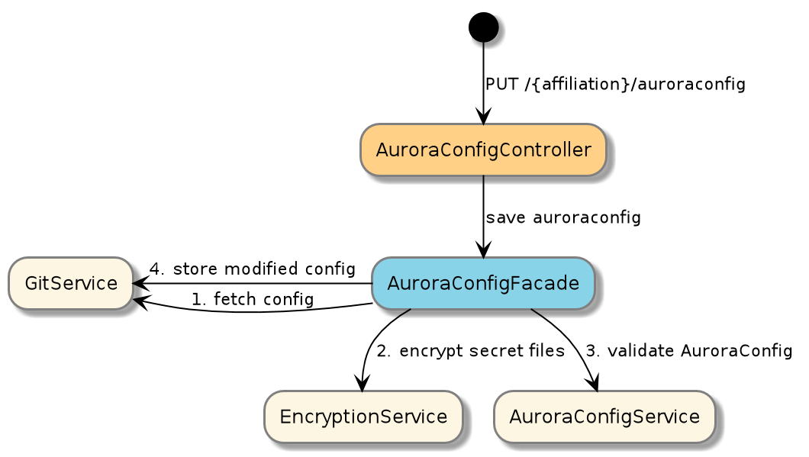
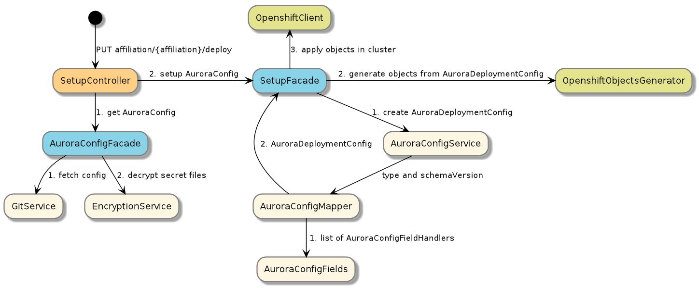

# Boober

Boober is our take on how to handle the `wall of yaml` challenge of Kubernetes. It reads configuration files with a given
schemaVersion from a git repo (AuroraConfig) and transforms it into Openshift Objects via a AuroraDeploymentConfiguration.

## How to run locally
First start up a local version of boober. Either in you ide or by running

      ./gradlew run 
      
Then run the script `testscripts/setup-local.sh` 
 - import configuration into your local git repo in `/tmp/boobergit/paas`
 - see the configuration
 - deploy an application
 
 
## Architecture
  
Boober uses Git as a storage mechanism for its config files. Boober owns this repository and it should be the only
component writing to it. It will ensure that the files written are valid and that secrets are encrypted.

### How AuroraConfig is aved into git



### How objects in OpenShift are created


## Concepts

### Affiliation
An affiliation is a group of projects and environments that are managed by the same team. Each affiliation has a 
seperate git repo where their configuration is stored. 

All projects created in openshift start with the name of the affiliation. 

The affiliation project (has the same name as affiliation) is set up when a project has its Onboarding.

### AuroraConfig
A set of versioned files (all files in one affiliation must have the same version) to express how to create projects
and deploy applications on OpenShift

filename           | name          | description  
-------------------|---------------|:-----------------------------------------------------------------
about.json         | global        | Global configuration for all applications in an affiliation 
utv/about.json     | environment   | Environment configuration that is shared by all applications in an openshift project
reference.json     | application   | Configuration shared by all instances of an application in all projects
utv/refernce.json  | override      | Configuration specific to one application in one openshift project

All properties in AuroraConfig can be set inn all files.
 
Below is an json with all possible values ( and some comments)
```
{
  "schemaVersion" : "v1", //only supported version for now. Will get bumped if/when breaking changes occur
  "type" : "deploy",  //valid types are deploy,development,localTemplate, template
  "name" : "reference",
  "cluster" : "utv", //what cluster to run on. We have 6 clusters utv,test,prod and utv-relay, test-relay, prod-relay
  "replicas": 3, //run application in 3 replicas
  "flags": {
    "cert": true, //generate keystore with cn=$groupId.$artifactId
    "rolling": true, //we want rolling upgrade
    "debug" : true, //turn on remote debugging. NB Should only be used in development
    "alarm" : true //should this installation trigger alarms. Set to false to avoid alarms when setting up. In Prod it is always on
  },
  "permissions": {
    "admin": {
      "groups": "APP_PaaS_drift APP_PaaS_utv" //what AD groups can admin this project in openshift
     }
  },
  "route": {
    "generate": true, //will set host to $name-$namespace. 
    "path" : "/foo",
    "host" : "custom-host", //will get cluster prefix added
    "annotations" : {
       "balance" : "lastconn" //set haproxy annotations. https://docs.openshift.com/container-platform/3.5/architecture/core_concepts/routes.html#route-specific-annotations
     }
  },
  "resources" : { //set memory/cpu request and limit
    "cpu": {
      "max": "2000m",
      "min" : "0"
    },
    "memory": {
      "max": "256Mi",
      "min" : "128Mi"
    }
  },
  "groupId": "ske.aurora.openshift.referanse", //groupId for what to deploy
  "artifactId": "openshift-referanse-springboot-server", //artifactId for what to deploy
  "version": "0", //version to follow
  "prometheus": { //where is prometheus located
    "port": "8081",
    "path": "/prometheus" 
  },
  "webseal": { //open up firewall with webseal
    "path": "webseal-path", 
    "roles": "role1, role2"
  },
  "managementPath": ":8081/actuator", //where is the management interface located
  "database": "referanseapp", //fetch or create database with this name from DatabaseHotel
  "config": {
    "1.properties" : { //all applications that run in the 1 tree will get this
           "FOO": "bar" //this will be an ENV var
          },
    "latest.properties": { //all other applications will get this
      "FOO": "baz"  //this will be an ENV var
    }
  
  },
  "secretFolder": "/tmp/test" //all files inside this dir is added in a secret.
}

```

### AuroraDeploymentConfiguration
An internal represetantion of AuroraConfig that is normalized from an AuroraConfig via a AuroraConfigMapper abstraction.
The mapping process knows which part of the AuroraConfig a given property is from. 

Knowing the source off all properties makes it easy to create good UI experience on top of the API. 
