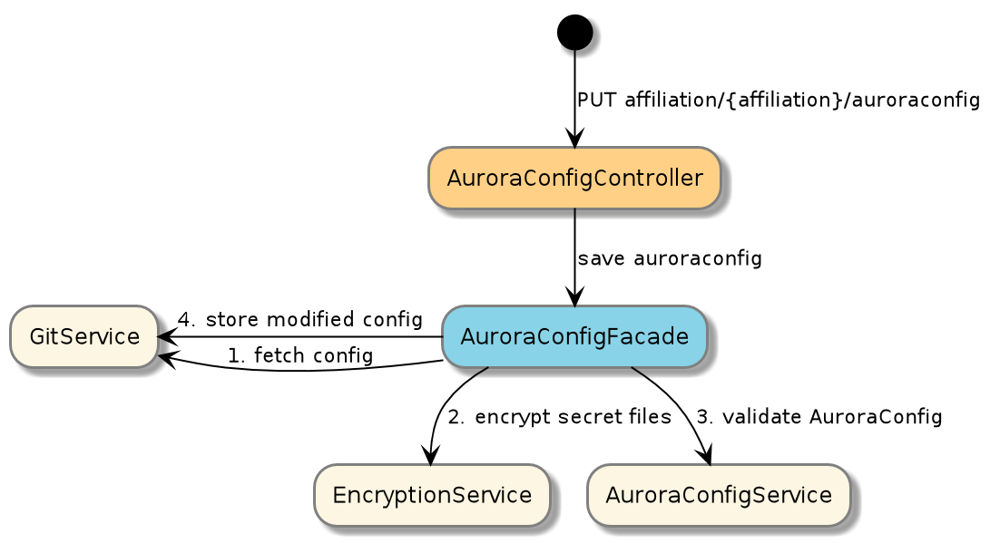

# Boober

Boober is our take on how to handle the `wall of yaml` challenge of Kubernetes. It reads configuration files with a given
schemaVersion from a git repo (AuroraConfig) and transforms it into Openshift Objects via a AuroraDeploymentConfiguration.

## How to run locally
First start up a local version of boober. Either in you ide or by running

      ./gradlew run 
      
Then run the script `testscripts/setup-local.sh` 
 - import configuration into your local git repo in `/tmp/boobergit/paas`
 - see the configuration
 - deploy an application
 
 
## Architecture
  
Boober uses Git as a storage mechanism for its config files. Boober owns this repository and it should be the only
component writing to it. It will ensure that the files written are valid and that secrets are encrypted.

### How AuroraConfig is aved into git

### How objects in OpenShift are created

## Concepts

### AuroraConfig
A set of versioned files (all files in one affiliation must have the same version) to express how to create projects
and deploy applications on openshift

### AuroraDeploymentConfiguration
An internal represetantion of AuroraConfig that is normalized from an AuroraConfig via a AuroraConfigMapper abstraction.
The mapping process knows which part of the AuroraConfig a given property is from. 

Knowing the source off all properties makes it easy to create good UI experience on top of the API. 
